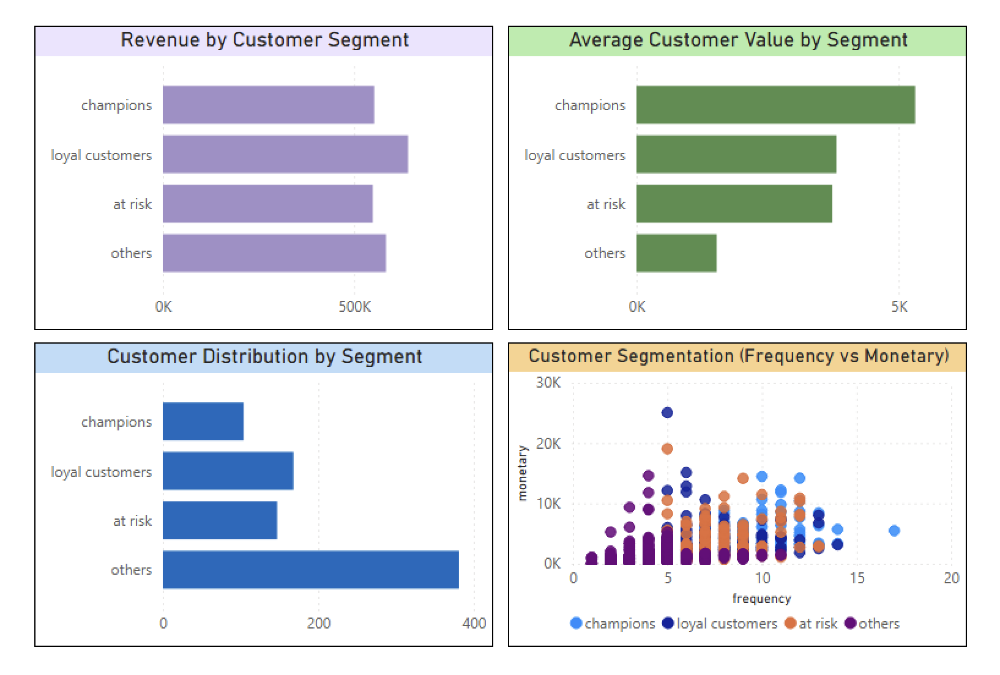

Customer Segmentation Analysis (RFM)

📊 Project Overview

This project analyzes retail sales data to segment customers based on their purchasing behavior using the RFM (Recency, Frequency, Monetary) model.

The goal is to identify high-value customers, detect at-risk users, and support data-driven business decisions.

❓Problem Statement:

Businesses often treat all customers equally, but not all customers contribute equally to revenue and profitability.

This project answers:
	•	Who are the most valuable customers?
	•	Which customers are at risk of churn?
	•	How is customer value distributed?

⚙️ Approach

🔹 RFM Segmentation

Customers were segmented using:
	•	Recency (R): Days since last purchase
	•	Frequency (F): Number of orders
	•	Monetary (M): Total revenue generated

  Each metric was scored using SQL window functions:
  NTILE(5) OVER (ORDER BY ...)

  🔹 Customer Segments
	•	Champions: High R, F, M
	•	Loyal Customers: Consistent buyers
	•	At Risk: Previously active but declining
	•	Others: Low engagement and value

  📈 Key Insights
	•	Most customers fall into the “Others” segment
	•	Champions generate the highest average revenue per customer
	•	A significant portion of customers show low engagement and low value
	•	At-risk customers still generate value but show declining activity

  🛠️ Tools Used
	•	SQL (PostgreSQL)
	•	Power BI

  ## 📊 Dashboard

  💡 Business Impact

This segmentation enables:
	•	Targeted marketing campaigns
	•	Customer retention strategies
	•	Better allocation of discounts and promotions
  
